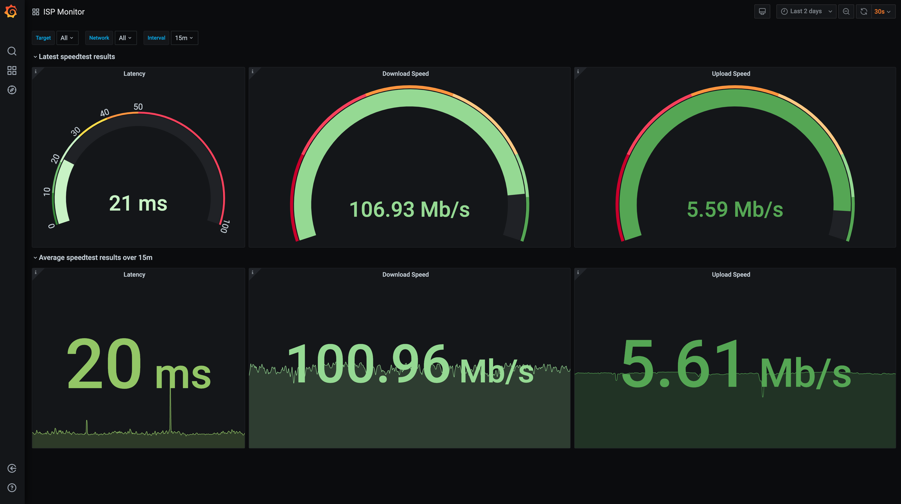

# isp-monitor

Helm Chart for deploying a full stack for ISP Monitoring including [Prometheus](https://github.com/prometheus/prometheus),
[Grafana](https://github.com/grafana/grafana), [speedtest-exporter](https://github.com/timebertt/speedtest-exporter) and
[blackbox-exporter](https://github.com/prometheus/blackbox_exporter).

## Quick Start

Install this [helm](https://helm.sh) chart by running:

```commandline
helm repo add timebertt https://timebertt.github.io/helm-charts
helm install isp-monitor timebertt/isp-monitor
```

## Preview


